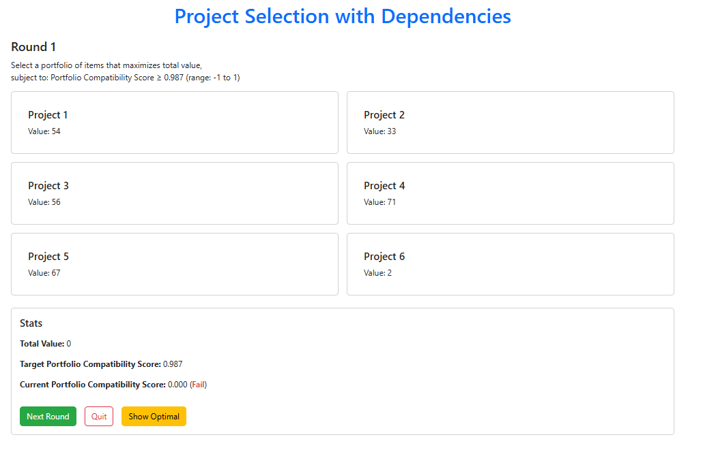
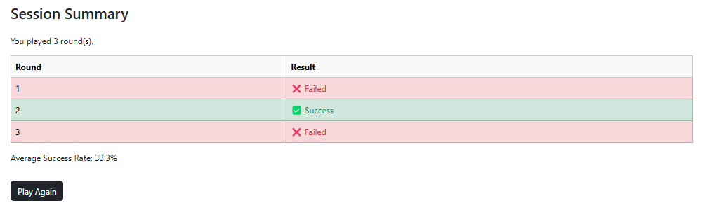

# Project Selection with Dependencies

A modern web game designed to explore decision-making in portfolio selection under compatibility constraints. Built with React, Bootstrap, and Vite — and deployed via GitHub Pages and Vercel Proxy logging.

---

## 🎮 Gameplay Concept

Players must select a subset of items (projects) to maximize total value **while ensuring that their selection meets a minimum portfolio compatibility score** — calculated using **cosine similarity** of hidden attribute vectors.

This models real-world decision challenges in innovation, investment, or resource allocation where value and coherence must be balanced.

---

## 🛠 Technologies Used

- **Frontend:** React + Vite + Bootstrap
- **Logging:** Vercel Proxy → Google Apps Script → Google Sheets
- **Deployment:** GitHub Pages

---

## 🧩 Live Game

- 🧩 Game: [Play here](https://konstantinosstouras.github.io/lab/knapsack-with-dependencies)
- 🔁 Proxy: [https://knapsack-with-dependencies.vercel.app/api/submit](https://knapsack-with-dependencies.vercel.app/api/submit)

---

## 🖼️ Gameplay Preview

  
  

---

## 📚 License

MIT — use freely and credit for educational or experimental purposes.
